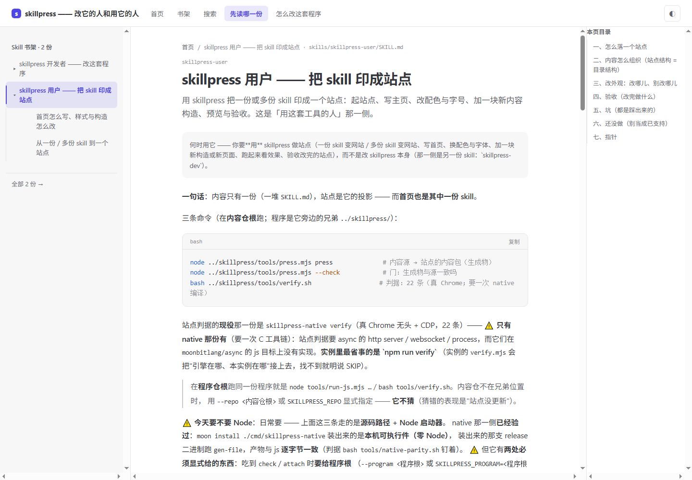
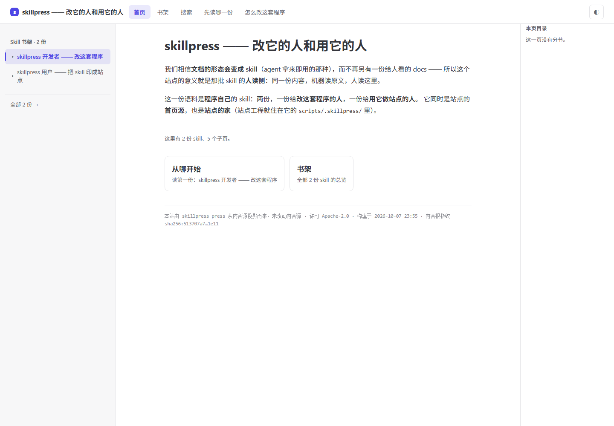

# skillpress

**把一堆写给 AI 看的 skill，印成一个给人看的站点。**

内容只有一份：你的 `skills/**/SKILL.md`。skillpress 把它投影成一个静态站 —— 左侧书架树、
正文、右栏本页目录、`⌘K` 搜索、构建期算好的代码高亮 —— 并且**用同一次解析**产出给 agent 的
`llms.txt` 与每页原文（`md/**`）。所以站点不是第二份内容：删掉它不丢东西，改内容永远只改一处。



上面这个站是拿这套工具**自己的 skill** 印的（自举实例：
[`skills/skillpress/scripts/.skillpress/`](skills/skillpress/scripts/.skillpress/)）。
首页长这样：



**它适合你，如果你**：已经（或打算）把文档写成"一个目录 + 一份 `SKILL.md`"，并且想让同事
能点开一个站看 —— 而不是为此再维护第二份"给人看的文档"。
**它不适合你，如果你要**：能被搜索引擎抓到正文的官网、博客、或者任何需要服务端的东西。
站点是整站客户端渲染的，原因与代价写在下面「今天做不到什么」。

| | |
|---|---|
| 要装什么 | Node ≥ 20 与 [MoonBit 工具链](https://www.moonbitlang.com/download/)；跑站点判据另需 Chrome 与一次 C 工具链 |
| 拿到什么 | 纯静态 `dist/`（HTML + 一个 bundle + 图片），hash 路由 ⇒ 扔进任何静态服务器就能跑，不需要服务端回退规则 |
| 怎么装 | `moon add XiLaiTL/skillpress@0.1.1` |
| 许可 | Apache-2.0（内含随包发的 tree-sitter 运行时与五门语法，见 [`THIRD-PARTY-NOTICE.md`](THIRD-PARTY-NOTICE.md)） |

## 快速上手

前提：你的工程里有一个 `skills/` 目录，里面**至少有一份** `SKILL.md`。

```bash
# ① 装包，并编一次 CLI（包里不带构建产物，这一步省不掉）
moon add XiLaiTL/skillpress
moon -C .mooncakes/XiLaiTL/skillpress build cmd/skillpress --target js

# ② 生成站点工程（写进 <内容根>/skillpress/scripts/.skillpress/）
node .mooncakes/XiLaiTL/skillpress/launcher/skillpress.mjs attach --repo . --skills ./skills

# ③ 印内容 → 打包 → 起服务
cd skills/skillpress/scripts/.skillpress
npm install && npm run press && npm run build && npm run serve     # → http://127.0.0.1:8123/
```

第 ③ 步里写成 `skills/…`，是因为第 ② 步给的内容根是 `./skills`；内容根换到别处，站点工程就
跟着落在那个目录下的 `skillpress/scripts/.skillpress/`。第一次 `npm install` 要下
esbuild / react / react-native-web，慢一点。

`attach` 是**幂等**的：第二次跑**不覆盖**你手改过的文件（要覆盖加 `--force`）。它还会扫一遍
内容根，把"不上书架"的那几份连同**每一条的理由**写进 `skillpress.ignore.md`（没写理由就报错）。

改完内容之后：

```bash
npm run press:check   # 产物与内容源对得上吗 —— 忘了重跑 press 时它会红，并指出第一处差异
npm run build         # 重新打包（默认 minify；开发用 npm run build:dev）
```

**部署**：把 `dist/` 整个拷过去就行（GitHub Pages / Netlify / 公司内网 nginx）—— 路由在 `#`
后面，不需要 404 回退规则。

## 内容怎么写

一份 skill = 一个目录 + `SKILL.md`：

```markdown
---
name: alpha
description: 一句话说清这份 skill 干什么（会出现在书架上那一行）
whenToUse: 什么时候该用它
---

# alpha

正文。标题、列表、表格、引用、围栏代码块都认。
```

- 深水区放 `references/*.md`，它们会变成这份 skill 的子页（树上展开）
- 站点首页来自 `skills/skillpress/WEBSITE.md`；`attach` 会拿你仓根的 `README.md` 改写一份
- 站名与首页大标题 = 首页源的 `# H1`；首个 `##` 之前的段落 = 首页导语
- 首页里 `## [标题](目标.md)` **整条是链接** ⇒ 变成顶栏一条导航，点了直接渲染目标那一页
- 正文是**标准 markdown，不加任何站点专用语法** —— 它在 GitHub 上、在编辑器里、在 agent 手里都还是它自己

完整的写法、支持的构造清单、以及改完的验收步骤 →
[`skills/skillpress-user/SKILL.md`](skills/skillpress-user/SKILL.md)（它本身就是站点上的一页）。

## 改外观

配色、字号、间距只在两处：`shell/theme.mbt` 与 `shell/tokens.mbt`。
界面住在**程序包里**（生成出来的 `app.mbt` 只有 19 行接线），所以升级 skillpress =
所有站点一起升级，而不是每个站点各自抄一份界面。

## 今天做不到什么（先看这段，再决定用不用）

| 做不到 | 代价 |
|---|---|
| **没有预渲染** | 整站客户端渲染，`#root` 里是空壳：没有 JS 打不开，搜索引擎抓不到正文 |
| **首页里 `##` 的正文不上首页** | 首页只渲染 H1、首个 `##` 之前的段落、统计行与两张入口卡。想让首页出现某段话：写进首屏，或者做成一页再用纯链接节指过去 |
| `*斜体*` 与行内图片 | 按字面 / 按原文处理（内容源里不发明语法，所以宁可不支持某个效果） |
| 表格列多了会挤 | 列宽等分、不能横向滚动 |
| bundle 偏大 | minify 后约 680 KB（gzip 后约 200 KB），大头是 react-native-web |
| 搜索索引在**渲染期现算** | 内容很大时会变慢（构建期索引还没做） |
| 站点判据只有 native 那份有 | `verify` 要 Chrome + 一次 C 工具链；js 那条路会**明说"只有 native 有"并退 2** |
| `pack`（打成便携目录） | 还没做：命令会说清"还没做" + 退 2，不假装跑过 |

认不出的内容构造**点名报错 + 退 2 + 不吐产物**，不会静默丢掉。

## 自己验证

```bash
npm run press:check   # 生成物与内容源逐字节一致
npm run verify        # 站点判据：自起服务 + 真 Chrome 无头 + 23 条断言（要一次 native 编译）
```

那 23 条每条都对应一种**会安静发生**的失败：导航少一条、图片没显示、控制台报错、代码块没上色……
产物是文字，编译器不会替你发现这些。

## 仓库里有什么

| 路径 | 是什么 |
|---|---|
| `engine/` | 引擎：markdown → 内容包、内容门（G1–G8）、构建期上色 |
| `shell/` | 站点界面：顶栏 / 书架树 / 正文渲染 / 目录 / 搜索 / 主题 / 路由 |
| `cmd/` ｜ `launcher/` | CLI；随包发的启动器与 `press` |
| `template/instance/` | 站点工程模板（`attach` 就是把它按占位符渲染出来） |
| `skills/skillpress-user/` | 「用这套工具」那份 skill（写法与验收） |
| `skills/skillpress-dev/` | 「改这套程序」那份 skill（四个根、门、管线） |
| `grammars/` ｜ `vendor/` | 五门语法资产与 tree-sitter 运行时，都随包发 |

## 更多文档

| 想干什么 | 去哪 |
|---|---|
| 用这套工具做站点 / 写首页 / 换配色 | [`skills/skillpress-user/SKILL.md`](skills/skillpress-user/SKILL.md) |
| 改这套程序（引擎 / 门 / 判据 / 发版） | [`CONTRIBUTING.md`](CONTRIBUTING.md) |
| 投影规范：收录判据 / 一个 skill 的固定结构 / 预算 | [`SPEC.md`](SPEC.md) |
| 集合划分：哪些内容该做成 skill | [`SKILLS.md`](SKILLS.md) |
| 做到哪儿了、为什么这么做（决定表，每条带当天读数） | [`PLAN.md`](PLAN.md) |
| 站点界面 / 版式 / 交互的设计 | [`DESIGN-site.md`](DESIGN-site.md)、[`PLAN-ui.md`](PLAN-ui.md) |
| 文档与代码不一致的账、怎么防漂 | [`DRIFT.md`](DRIFT.md) |

## 许可

Apache License 2.0，见 [`LICENSE`](LICENSE)。第三方清单在
[`THIRD-PARTY-NOTICE.md`](THIRD-PARTY-NOTICE.md)，五门语法资产的版本与 sha256 在
[`grammars/PROVENANCE.md`](grammars/PROVENANCE.md)。
